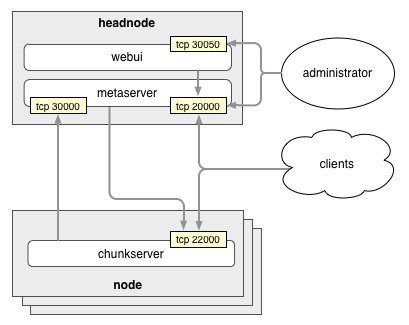
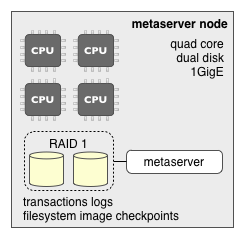
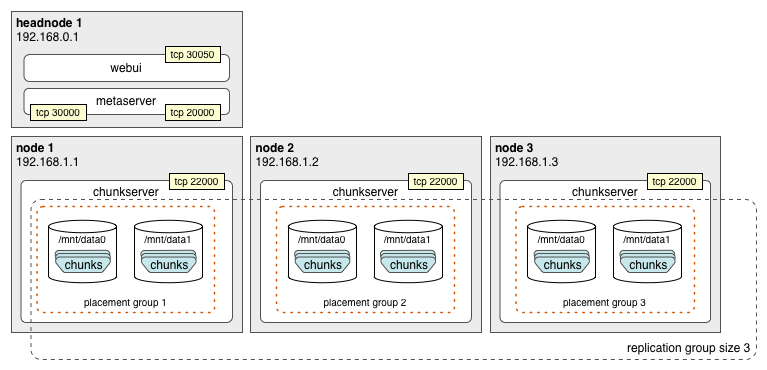
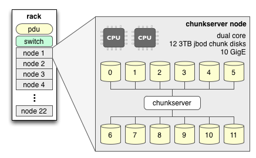
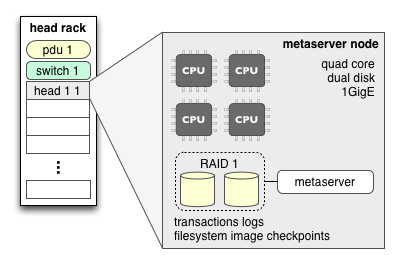
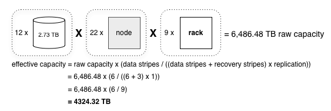

The Quantcast File System (QFS) is designed to run on a cluster of nodes built
with commodity hardware, which includes desktop grade disk drives and 1- to
10-gigabit ethernet interconnects. The design is focused on fault tolerance,
performance, scalability and storage efficiency.

QFS supports two types of fault tolerance: chunk replication and Reed-Solomon
encoding. This document will discuss a simple deployment optimized for each
method, along with a larger-scale advanced deployment.

**NOTE**: At file creation time either chunk replication or Reed-Solomon
encoding must be specified; QFS does not impose a default method. The
deployments discussed in this document maximize fault tolerance for when
either method is most commonly used.

Components
----------
QFS consists of several software components:

- **metaserver**: The brains of the operation, the *metaserver* hosts the file
  system image in memory.
- **chunk server**: *The chunk server* does the heavy lifting of storing and
  retrieving blocks.
- **clients**: *Clients* talk to the *metaserver* to get metadata about where
  blocks are stored, and then to the *chunk servers* to get the data blocks.

Metaserver
---------
The metaserver stores the file system image in memory. This includes:

- All file metadata including directory structure, file names, mtime, etc ...
- The file-ID-to-chunk-ID mappings.
- Chunk locations.

The file system data is broken down into many chunks that are stored and managed
by the chunk servers. The metaserver also balances load and space utilization
across these chunk servers.

The hardware hosting a metaserver should have a fault-tolerant disk array for
its transaction logs and checkpoints, along with a few cores.

QFS also includes a Python-based web reporting interface, which provides general
file system status including (but not limited to):

- Data chunk processing queues.
- Connected chunk servers.
- Chunkserver connection history.
- Capacity information.
- General file system health information.

Chunk Server
------------
The chunk server is the workhorse of QFS. All QFS client I/O operations go
through the chunk servers, which store data chunks of up to 64 megabytes in size
on their host file systems. The chunk servers also replicate and recover chunks
as instructed by the metaserver. Each chunk server monitors the health of its
host file systems and reports their status back to the metaserver.

Chunkserver nodes need few cores, but they should be heavy on network throughput
and spindles. The disks which store chunks should be left in a JBOD
configuration and be specified individually in the chunk server configuration.
XFS is the recommended file system on which to store chunks, as the chunk
servers use XFS direct I/O which bypasses the OS buffer cache to improve
performance. The XFS file space reservation feature is used to minimize
fragmentation.

Clients
-------
QFS ships with several client tools:

- A Java interface for Hadoop
- A Python library
- Both static and dynamic C/C++ libraries

The client communicates with the metaserver to create files, modify file
attributes, and to retrieve file-to-chunk mapping information, which it then
uses to access file chunks via the chunk servers.

Simple Cluster
--------------
### Using Chunk Replication
The simplest cluster configuration is replication mode. When a file is created
with replication *k*, chunks will be replicated *k* times. The downside to this
is that you also will need *k* times as much storage. In the example below, a
three-node cluster with one head node is optimized for a replication count of
three.

**NOTE**: This configuration does not preclude the use of Reed-Solomon encoding,
as the client sets the fault tolerance of each file individually when it is
created. Layout

QFS supports the notion of chunk placement groups which force chunk replicas to
specific nodes or groups of nodes. This prevents all of the replicas for a
given chunk from being placed on the same node, as the failure of such a node
would mean the loss of that chunk.

In the example above, three placement groups have been denoted, one for each
chunk replica. The *metaServer.rackPrefixes*
[[configuration parameter|Configuration-Reference]] is used to organize
placement groups.

#### Configuration

##### MetaServer.prp

    # port used by clients to connect to the metaserver
    metaServer.clientPort = 20000

    # port used by chunk servers to connect to the metaserver
    metaServer.chunkServerPort = 30000

    # chunk placement groups by IP address or first three octets
    metaServer.rackPrefixes = 192.168.1.1 1   192.168.1.2 2 192.168.1.3 3

    # create new file system if no transaction logs or checkpoints are found
    metaServer.createEmptyFs = 1

    # location to write transaction logs
    metaServer.logDir = /home/qfsm/transaction_logs

    # location to write checkpoints, this needs be pruned periodically
    metaServer.cpDir = /home/qfsm/checkpoint

    # unique cluster id
    metaServer.clusterKey = my-fs-unique-identifier

##### ChunkServer.prp

    # address of the metaserver, host names should not be used
    chunkServer.metaServer.hostname 192.168.0.1

    # metaserver port for chunk server to use
    chunkServer.metaServer.port = 30000

    # chunk server client listener port
    chunkServer.clientPort = 22000

    # locations to store chunk data, independent spindles should be
    used
    chunkServer.chunkDir = /mnt/data0 /mnt/data1

    # unique cluster id
    chunkServer.clusterKey = my-fs-unique-identifier

##### Notes
- DNS based host names are not supported; instead, IPv4 addresses should be
  used.
- The metaserver checkpoint directory (*metaServer.cpDir*) needs to be
  periodically [[pruned|Administrator's-Guide]]. Each checkpoint file will be
  approximately the size of the file system image in memory.
- The *clusterKey* parameters must match across all chunk servers and the
  metaserver they communicate with. This allows a given node to host chunk
  servers for multiple QFS file systems, as long as each has its own metaserver
  and *clusterKey*.

### Using Reed-Solomon Encoding
Using Reed-Solomon encoding for fault tolerance is far more space efficient than
replication. Rather than writing multiple copies of each chunk, the client
library generates parity information that allows the chunk to be reconstructed
and then stripes that information across other chunks. This efficiency comes at
the cost of increased recovery bandwidth, or the time it takes to reconstruct a
given chunk; since a copy of the lost chunk is not sitting around waiting to be
utilized, it must be reconstructed from the remaining data stripes which takes
more time and bandwidth.

In this example, the minimum sized Reed-Solomon cluster equivalent to
replication 4 is configured.

**NOTE**: This configuration does not preclude the use of chunk replication, as
the client sets the fault tolerance of each file individually when it is
created.

#### Reed-Solomon \<rs k,m+n\>
| Value | Description |
| ----- | ----------- |
| k | replication factor, normally 1 with n 3, and more than 1 with n == 0 |
| m | data stripe count, valid range is 1 to 64 with n == 3, and 255 with n == 0 |
| n | recovery stripe count, only 0 and 3 are presently valid, with n == 0 pure striping -- no recovery |

Currently the only extensively tested encodings are *\<rs 1,6+3\>* and
replication 3 (expressed as *\<rs 3,6+0\>*). QFS supports increasing the number
of data stripes in order to reduce the overhead of extra storage space added by
the recovery data stripes. However, regardless of how many data stripes you use,
qfs still only supports either 0 or 3 recovery stripes for all the data stripes.
This means that the same number of recovery stripes are responsible for a larger
number of data stripes.

#### Replication vs Reed-Solomon
The currently supported RS encoding is *\<rs 1,6+3\>*; this uses only 50% more
space than the chunk data, but allows for the loss of three chunks. By
comparison, chunk replication with a factor of three (*\<rs 3,6+0\>*), uses 200%
more space than the chunk data and only allows for the loss of 2 chunks.

| encoding | file size | space used | fault tolerance |
| -------- | --------- | ---------- | --------------- |
| replication 3 \<rs 3,6+0  | 6 MB | 18 MB | up to 2 chunks |
| replication 4 \<rs 4,6+0\> | 6 MB | 24 MB | up to 3 chunks |
| \<rs 1,6+3\> | 6 MB | 9 MB | up to 3 chunks |

**Some useful formulas:**

    disk usage = file size x ((data stripes + recovery stripes) / data stripes) x replication)
    effective capacity = raw capacity x (data stripes / ((data stripes + recovery stripes) x replication))

#### Layout
A minimum of 9 chunk servers is required for ideal fault tolerant chunk
placement. This is because the supported Reed-Solomon encoding, *\<rs 1,6+3\>*,
has a block size of 9 (data stripe count 6 + recovery stripe count 3). As in
the replication example above, the configuration below utilizes chunk placement
groups aligned with each node, which allows for the failure of 3 nodes without
data loss.

With Reed-Solomon *\<rs 1,N+3\>*, N+3 chunk servers is absolutely required in
order to handle 3 simultaneous chunk server failures.

For placement rebalance to work with N+3 RS encoding at least N+3 chunk servers
are required. The absolute minimum is N+1 to tolerate 1 chunk server failure.

The placement rebalance does not attempt to “equalize” number of chunks that
belong to the same chunk block between chunk servers due to assumption that the
number of chunk servers is at least N+3.

For example consider the following sequence: start with a single chunk server,
write a large enough file to create 9 chunks with 6+3 RS encoding, and then add
five more chunk servers. The placement rebalance is expected to move 5 chunks
from the fist server to the newly added 5 servers — one chunk on each newly
added server, leaving 4 chunks from the same RS group be on the first chunk
server. Therefore if the first chunk server becomes unavailable the chunk block
will become unavailable too.

This means, for instance, that if you have only 6 chunkservers with 6+3 RS
encoding, some files may suffer data loss with even a single machine failure.

#### Configuration
##### MetaServer.prp

    # port used by clients to connect to the metaserver
    metaServer.clientPort 20000

    # port used by chunk servers to connect to metaserver
    metaServer.chunkServerPort = 30000

    # chunk placement groups by IP address or first three octets
    metaServer.rackPrefixes = 192.168.1.1 1   192.168.1.2 2   192.168.1.3 3   192.168.1.4 4   192.168.1.5 5   192.168.1.6 6   192.168.1.7 7   192.168.1.8 8    192.168.1.9 9

    # create new file system if no transaction logs or checkpoints are found
    metaServer.createEmptyFs = 1

    # location to write transaction logs
    metaServer.logDir = /home/qfsm/transaction_logs

    # location to write checkpoints, this needs be pruned periodically
    metaServer.cpDir = /home/qfsm/checkpoint

    # unique cluster id
    metaServer.clusterKey = my-fs-unique-identifier

##### ChunkServer.prp

    # IP address of the metaserver, host names should not be used
    chunkServer.metaServer.hostname 192.168.0.1

    # metaserver port for chunk server to use
    chunkServer.metaServer.port = 30000

    # chunk server client listener port
    chunkServer.clientPort = 22000

    # locations to store chunk data, independent spindles should be used
    chunkServer.chunkDir = /mnt/data0 /mnt/data1

    # unique cluster id
    chunkServer.clusterKey = my-fs-unique-identifier

#### Notes
- DNS based host names are not supported, instead IPv4 addresses should be used.
- The metaserver checkpoint directory (*metaServer.cpDir*) needs to be
  periodically pruned. Each checkpoint file will be approximately the size of
  the file system image in memory.
- The *clusterKey* parameters must match across all chunk servers and the
  metaserver they communicate with. This allows a given node to host chunk
  servers for multiple QFS file systems, as long as each has its own metaserver
  and *clusterKey*. Advanced Cluster

Here we discuss a larger scale QFS deployment, organized into racks with
dedicated networking and power. Each rack hosts 22 chunk server nodes:

There is also a head node rack to host the metaserver:

### Layout
Racks are natural failure groups, as at any given time they could have isolated
network or power failures. As such, racks make perfect chunk placement groups.
As discussed earlier, the supported encoding is *\<rs 1,6+3\>*, with 6 data and
3 recovery stripes. This means to support the equivalent of chunk replication 3
using Reed-Solomon encoding, we need a total of 9 racks: one rack for each
stripe in the Reed-Solomon block.

This cluster has an approximate capacity of 4324.32 TB or 4.22 PB after taking
into account the Reed-Solomon encoding overhead.

Unlike the previous Reed-Solomon example this cluster will place chunks by rack
instead of by node. In this configuration up to 3 racks can fail simultaneously
without a single file being lost. The thing to remember, however, is that
drives are failing all the time; in all probability the system would only
tolerate one or two racks out of service. Configuration

##### MetaServer.prp

    # port used by clients to connect to the metaserver
    metaServer.clientPort 20000

    # port used by chunk servers to connect to the metaserver
    metaServer.chunkServerPort = 30000

    # chunk placement groups by IP address or first three octets
    metaServer.rackPrefixes = 192.168.1 1   192.168.2 2   192.168.3 3   192.168.4 4   192.168.5 5   192.168.6 6   192.168.7 7   192.168.8 8    192.168.9 9

    # create new file system if no transaction logs or checkpoints are found
    metaServer.createEmptyFs = 1

    # location to write transaction logs
    metaServer.logDir = /home/qfsm/transaction_logs

    # location to write checkpoints, this needs be pruned periodically
    metaServer.cpDir = /home/qfsm/checkpoint

    # unique cluster id
    metaServer.clusterKey = my-fs-unique-identifier

##### ChunkServer.prp

    # address of the metaserver, host names should not be used
    chunkServer.metaServer.hostname 192.168.0.1

    # metaserver port for chunk server to use
    chunkServer.metaServer.port = 30000

    # chunk server client listener port
    chunkServer.clientPort = 22000

    # locations to store chunk data, independent spindles should be used
    chunkServer.chunkDir = /mnt/data0 /mnt/data1

    # unique cluster id
    chunkServer.clusterKey = my-fs-unique-identifier

Best Practices
--------------
- Use a reliable service manager for both the meta and chunk servers such as
  [daemontools](http://cr.yp.to/daemontools.html). daemontools has the added
  benefit of log service management.
- Create file system specific user names for the meta and chunk servers you run.
  This will make for easy management of rogue processes and prevent multiple
  file systems from clobbering one another.
- Be sure to store chunk data on reasonably sized volumes--the more spindles,
  the better.
- Periodically back up the file system image checkpoints generated by the
  metaserver. They can be used to restore the file system in the event of a
  catastrophic failure of the head node.
- Be sure to prune the file system image checkpoints generated by the metaserver
  in *metaServer.cpDir*.
- Build out a fault tolerant node with dual power supplies and hardware RAID for
  your metaserver.
- Do not locate your metaserver head node in the same rack as your chunk
  servers.

Related Documents
-----------------
- [[Administrator's Guide]]
- [[Configuration Reference]]

