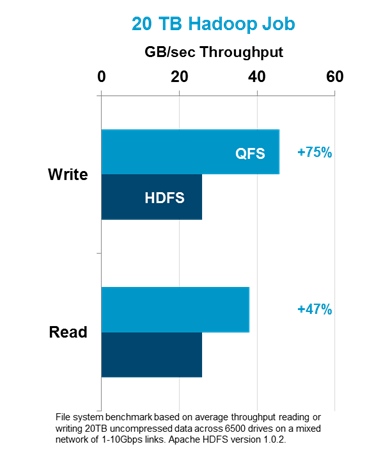
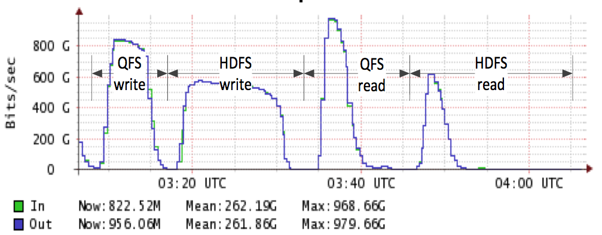

First off, QFS gives you 50% space reduction over 3-way replication in QFS,
through erasure coding. At the same time it increases the number of
simultaneous failures tolerated from 2 to 3. Moreover, it's significantly
faster at scale, for the workload we tested on.

| Full Benchmark Results | MStress Benchmark Results |
| ---------------------- | ------------------------- |
|  |  |

| Aggregate network bandwidth during one round of tests |
| ----------------------------------------------------- |
|  |

Read and Write Throughput Benchmarks
------------------------------------
We ran **read** and **write** benchmarks on 20 TB of uncompressed data in two
configurations: Hadoop+HDFS and Hadoop+QFS. In each configuration we ran two
tests, a 20 TB **read** test and a 20 TB **write** test. We used replication 3
with HDFS and Reed-Solomon with QFS. We ran each configuration multiple times
and reported the best time. The time differences within runs with the same
configuration were below 4%, except for the Hadoop+HDFS read test, where there
was more variance.

QFS is 75% faster at writing. The amount of data is large enough to keep all
the disks in the system busy for minutes. While HDFS writes 60 TB of raw data
(3x replication), QFS only writes 30 TB of raw data (Reed-Solomon encoding).

QFS is also faster at reading, mainly because it deals better with stragglers.
We ran this test on an otherwise idle cluster. Once the majority of reads
completed, only a small number of stragglers were left, both with HDFS and QFS.
At that point Hadoop+QFS ran faster as workers read concurrently from 6 chunk
servers due to striping, whereas Hadoop+HDFS read from a single chunk server and
was bound by the speed of a single disk.

Metaserver Benchmarks
---------------------
The QFS metaserver (name node in HDFS) is the core of the file system. Its
responsiveness and scalability affect the throughput and scalability of the
whole cluster. At Quantcast we see production metaservers handling up to 100,000
simultaneous client connections.

Our metaserver test consisted of a number of directory operations: **create**,
**stat**, **list**, **remove**. We used directories because we could not compare
**file** creation speed as HDFS requires chunk servers for file creation,
whereas QFS does not. QFS had better throughput overall, and particularly so for
**create** and **stat** operations. It completed the same workload faster and
with less CPU consumption.

Small Print
-----------
Although we did use HDFS for years, we know QFS better. We don't claim that the
results are representative for QFS or HDFS performance in general. These are
simply the results that we measured in good faith on our production platform.

If you have an HDFS installation, you can compare the QFS metaserver against the
HDFS master head-to-head, from the comfort of your own laptop. See the
[metaserver benchmarks README](https://github.com/quantcast/qfs/blob/master/benchmarks/mstress/README).

